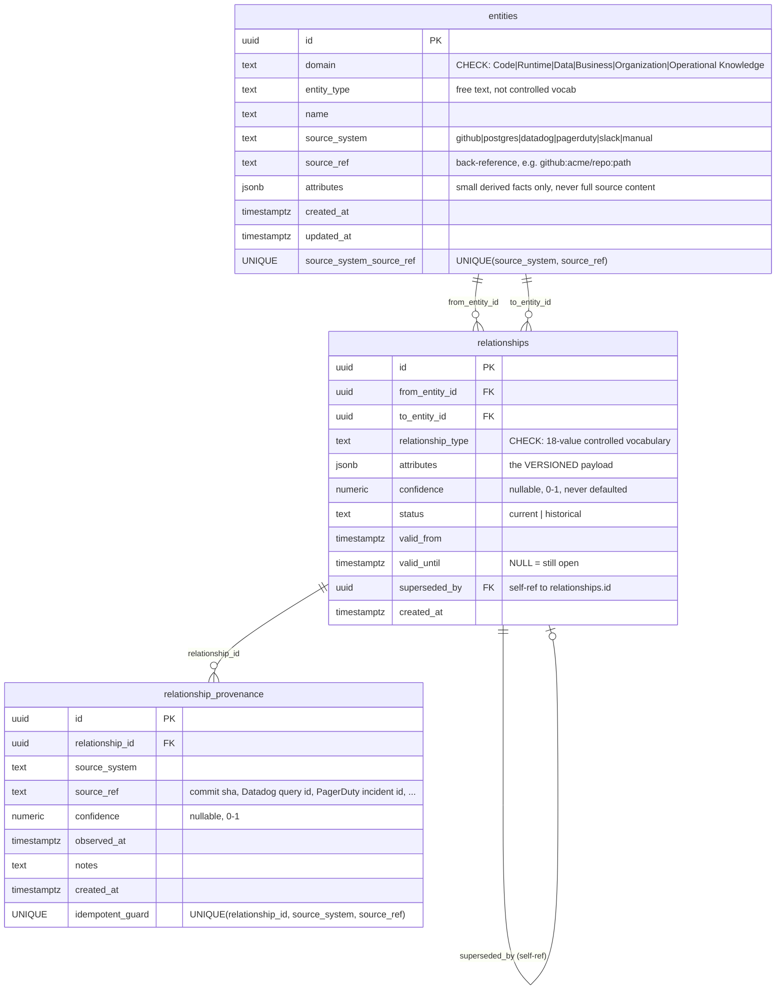
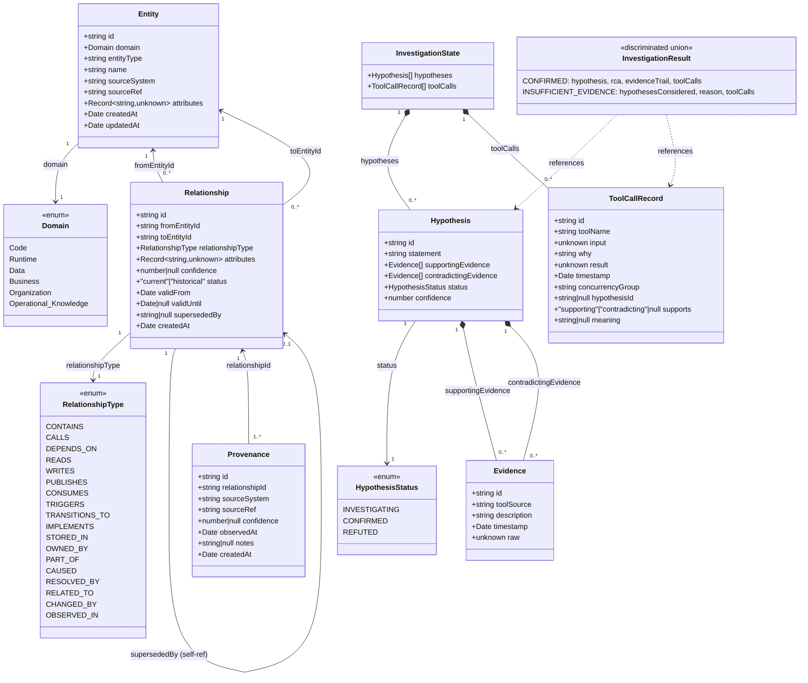
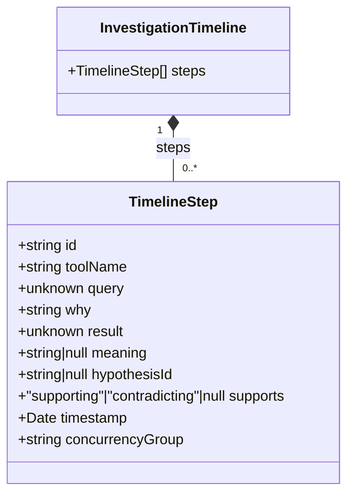

# Data Model

Companion to [`HOW-IT-WORKS.md`](./HOW-IT-WORKS.md) and
[`SEQUENCE-DIAGRAMS.md`](./SEQUENCE-DIAGRAMS.md). Two views of the same data: the persisted
Postgres schema (ERD), and the TypeScript domain types built on top of it (class diagram).

Source of truth for the ERD: `migrations/0001_init.sql`. Source of truth for the class diagrams:
`src/brain/types.ts` and `src/agent/types.ts` (section 2), and, for module 04's own display data
model, `src/timeline/types.ts` (section 3).

---

## 1. Entity-Relationship Diagram — Postgres schema

### Key constraints not visible in a plain ER diagram

- **`relationships_current_identity_uniq`** — a *partial* unique index:
  `UNIQUE (from_entity_id, to_entity_id, relationship_type) WHERE status = 'current'`. This is the
  invariant the whole versioning algorithm in `relationships.ts` is built around: at most one
  `current` row per identity triple, but unlimited `historical` rows.
- **`entities` identity** is `UNIQUE (source_system, source_ref)`, not `id` — that's what makes
  `upsertEntity`'s `ON CONFLICT DO UPDATE` work as an upsert keyed on origin, not on a
  caller-supplied id.
- **`relationship_provenance`'s** `UNIQUE (relationship_id, source_system, source_ref)` is the
  idempotent-reingestion guard — the same observation from the same source can be recorded twice
  with zero effect (`INSERT ... ON CONFLICT DO NOTHING`).
- This schema is **single-tenant by design** (see the migration's own comment) — no `tenant_id`
  anywhere. Adding multi-tenancy later would touch both unique indexes above plus every query
  predicate in `query.ts`/`relationships.ts`.
- `entity_type` is free text (`'Repository'`, `'File'`, `'Service'`, `'Table'`, ...) — only
  `domain` and `relationship_type` are DB-enforced controlled vocabularies.

---

## 2. Class Diagram — TypeScript domain types

Two type families, matching the two modules that own them: the Brain's persisted types
(`src/brain/types.ts`, mirrors the tables above 1:1), and the Investigation Agent's in-memory
types (`src/agent/types.ts`, not persisted — `InvestigationState` lives only in process memory for
the duration of one investigation).

### Reading the two halves together

- `Evidence.toolSource` is a free string (e.g. `"query_brain"`, `"search_code"`) naming which of
  the six agent tools produced it — there's no formal enum tying it back to the tool definitions
  in `tools.ts`.
- `Evidence.raw` is typed `unknown`. As of module 04's Task 1 retrofit it is **no longer always
  `null`**: `update_hypothesis` accepts an optional `stepId` param, and every evidence tool
  (`query_brain`, `search_code`, `query_database`, `search_logs`) now prefixes its return value
  with `` STEP_ID: <id>\n `` (the `id` of the `ToolCallRecord` that call just created) ahead of its
  normal output, so the model can learn a step's id and cite it later. When `update_hypothesis` is
  called with a `stepId` that matches a `ToolCallRecord.id` already in `InvestigationState.toolCalls`,
  that record is updated in place (`hypothesisId`, `supports`, `meaning` set) and the constructed
  `Evidence.raw` is set to that record's real `result` value — not `null`. If `stepId` is omitted,
  or doesn't match any recorded call's id, `raw` still comes back `null` (see `HOW-IT-WORKS.md`'s
  "Evidence tool parameters, STEP_ID citation, and concurrencyGroup" subsection for the exact
  mechanism).
- `ToolCallRecord.hypothesisId` is a free string (a `Hypothesis.id`) once `update_hypothesis` cites
  that step — there's no formal UML association back to `Hypothesis` in the diagram above, the same
  informal string-based link as `Evidence.toolSource`'s tool name. It's `null` for exploratory
  steps no `update_hypothesis` call has cited yet.
- The `InvestigationState` box above shows only its domain-relevant fields (`hypotheses`,
  `toolCalls`). The real interface (`src/agent/tools.ts`, not `types.ts`) also carries
  `batchCounter: number` and `batchOpen: boolean` — internal bookkeeping used only to derive
  `ToolCallRecord.concurrencyGroup`, not part of the evidence data model itself; see
  `HOW-IT-WORKS.md` for how those two fields work.
- `Hypothesis`/`Evidence`/`InvestigationState` are **not** persisted anywhere — no
  `investigations` or `hypotheses` table exists in `migrations/`. An investigation's reasoning
  trail currently disappears when the process holding `InvestigationState` exits. The same is true
  of `ToolCallRecord` and module 04's `TimelineStep`/`InvestigationTimeline` (section 3) — nothing
  in this module adds persistence either.
- The only durable link between the two halves is `Evidence.toolSource` naming `query_brain` /
  `search_code`, which internally read `Entity`/`Relationship` rows — but that link is by
  convention (a string), not enforced by any type.

---

## 3. Class Diagram — Module 04 Timeline Types

Module 04's own display data model (`src/timeline/types.ts`) — a pure rendering-shaped view over
`ToolCallRecord` (section 2), not persisted, not part of `src/agent/`.

### The `buildTimeline` transform

`buildTimeline(toolCalls: readonly ToolCallRecord[]): InvestigationTimeline`
(`src/timeline/build.ts`) is a pure function — no I/O, no mutation of the input array, no
dependency on `src/agent/` internals beyond the `ToolCallRecord` type itself. It:

1. Maps each `ToolCallRecord` to a `TimelineStep` 1:1. Every field carries through unchanged
   except `ToolCallRecord.input`, which becomes `TimelineStep.query` — the only field rename in the
   transform.
2. Sorts the resulting steps ascending by `timestamp.getTime()`.

`TimelineStep` exists as its own type (rather than reusing `ToolCallRecord` directly) purely so
the UI layer (`src/timeline/TimelineView.tsx`) can consume a name (`query`) that matches how it's
rendered, without coupling the display model to `src/agent/`'s internal field name (`input`).
