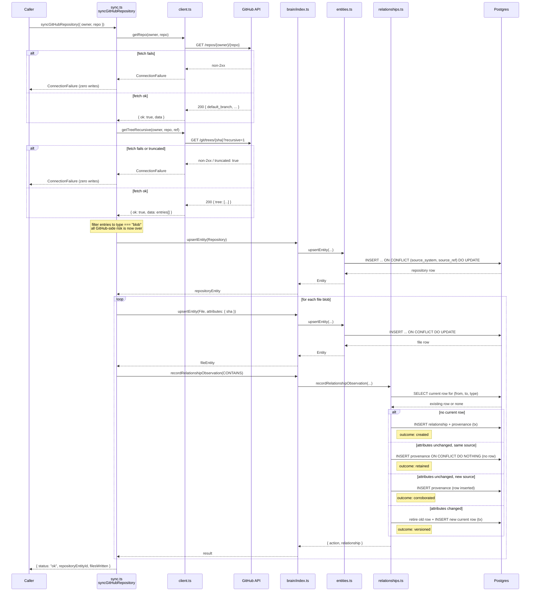
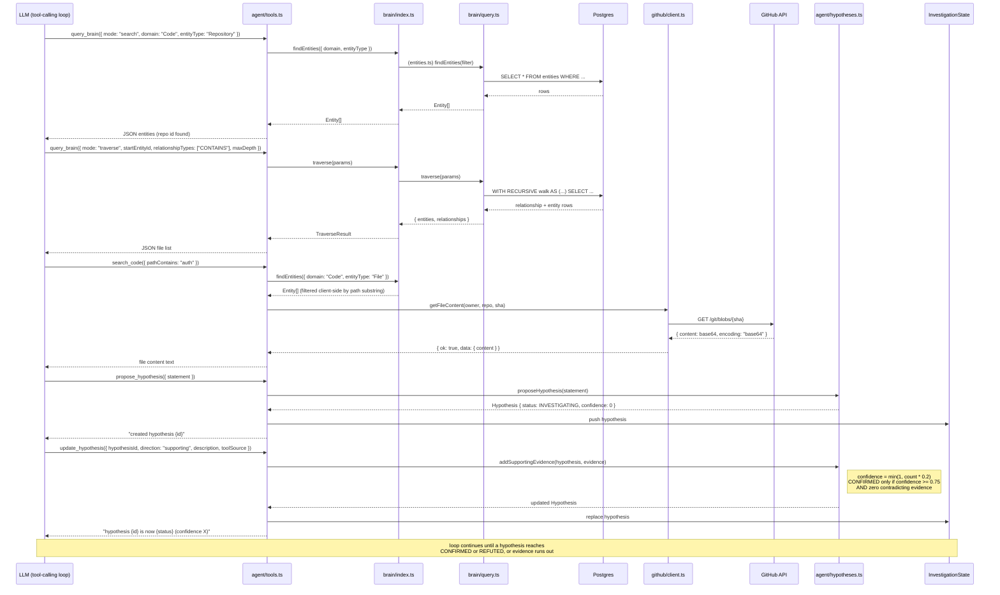

# Sequence Diagrams

Companion to [`HOW-IT-WORKS.md`](./HOW-IT-WORKS.md). Two flows: ingestion (GitHub → Brain) and
consumption (Investigation Agent → Brain). Diagrams render natively on GitHub and in any
Mermaid-aware viewer.

---

## 1. Ingestion — `syncGitHubRepository`

Fetch-before-write ordering: both GitHub calls must succeed before anything is written to the
Brain. The loop over files is collapsed to one representative iteration.

---

## 2. Consumption — Investigation Agent using the Brain

One investigation turn: bootstrap via search, traverse the graph, read live source, then move a
hypothesis's state. `hypotheses.ts` is the only code path allowed to change `status`/`confidence`
— the model only supplies evidence.

---

## Notes

- Both diagrams reflect the codebase as of this writing — `query_database` and `search_logs` are
  omitted from the consumption diagram since they are stubs that never reach a real data source.
- The `traverse` step shown is `direction: "outgoing"` (the default). See
  `company-brain-query-interface.md` for the `incoming`/`both` variants and why `both` is a union
  of two direction-consistent walks, not full undirected reachability.
